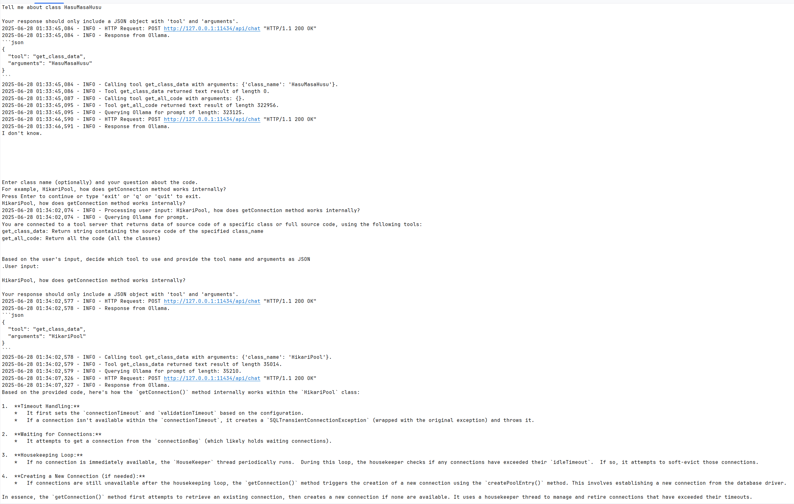

# mcp-example

Originally, it was challenge No 9, thanks Mark.

Build an application MCP server and MCP client.

This application takes user input - a question about code base. For demo, we use code base
[HikariCP repository](https://github.com/brettwooldridge/HikariCP)


The client code will talk to Ollama asking which alluvial tool to user. Currently, there are two tools.

```python
def get_class_data(class_name: str) -> str:
```
It returns source code of specified class.

```python
def get_all_code() -> str:
```
It returns all source code as a single text.

Then local model will analyse the code and return answer to user input.

I used [code-analyser](https://github.com/yan-khonski-it/dev-utils/tree/master/code-analyser) tool
to convert repository code into a single file.

## Prerequisites:
- Ollama and model, I use gemma3:4b

https://ollama.com/library/gemma3:4b

```commandline
ollama run gemma3:4b
```
- Python3

## Instructions
Navigate to the directory
```commandline
cd mcp-example
```

Create a virtual environment:
```commandline
python -m venv virtual_environment
```


Activate the virtual environment
```commandline
.\virtual_environment\Scripts\activate.bat
```

Deactivate the virtual environment:
```commandline
.\virtual_environment\Scripts\deactivate.bat
```

Install dependencies:
```commandline
pip install -r .\requirements.txt
```

Run application:
```commandline
python mcp_client.py
```

## Demo

[Demo](./documentation/demo.log)

